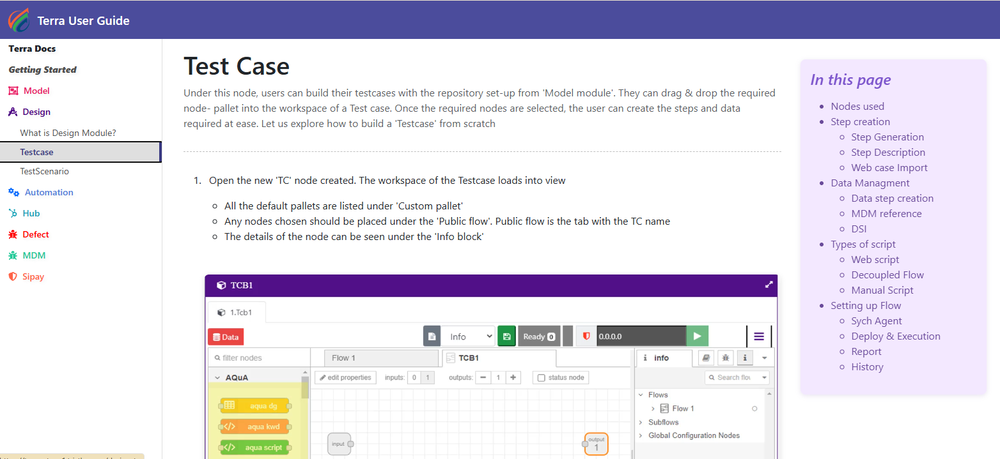

# What is Design Module?

Design is where test cases and scenarios get built from the repository set
up in Model. It groups two artifact types:

- [**Testcase**](nodes/testcase.md) — a single executable test, built from nodes dragged in from
  Model's custom pallet
- [**Scenario**](nodes/scenario.md) — groups test cases together by conditional flow, so a
  sequence of cases can represent one end-to-end business flow

Anything created in Design lives under a **Region**, which is unique to this
module (Model uses **Application** as its equivalent container instead).
