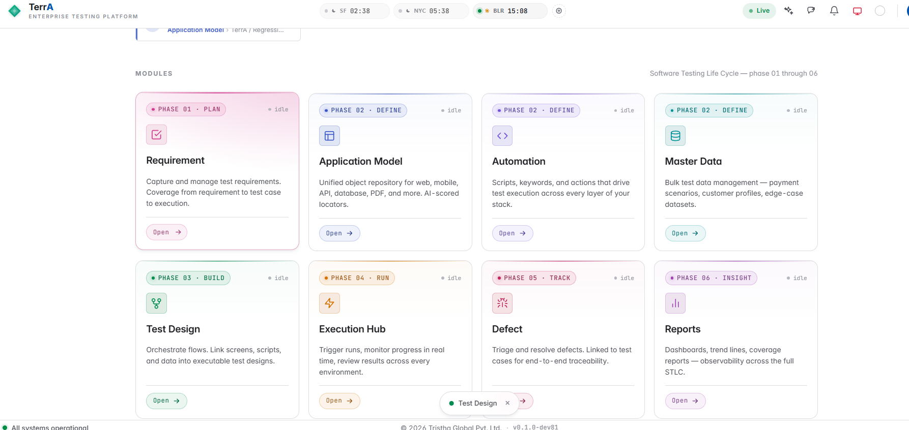

# Model overview

The Model module is where a project's systems under test get defined before
any test case can be built against them. Every artifact created here becomes
a reusable building block in Design and Automation.

## Artifact types

- [**WOR**](nodes/wor.md) — Web object repository
- [**Mobile OR**](nodes/mobile-windows-or.md) / [**Windows OR**](nodes/mobile-windows-or.md) — platform-specific object repositories
- [**API**](nodes/api.md) — API definitions, handled entirely server-side with no
  script or keyword-engine dependency
- [**Calc (CAL)**](nodes/calc.md) — calculation/simulation nodes
- [**PDF**](nodes/pdf.md) — document verification nodes; only three file-config steps
  (name, path, type) are needed before verify text/image steps
- [**FOR**](nodes/for.md) — billing and financial-record generation across organizations
  (medical claims, purchases, and similar record types)

## Where Model fits

Model sits in the Planning phase alongside Design, Hub, and Defect. Nothing
in Design can reference an object that hasn't been defined here first.
